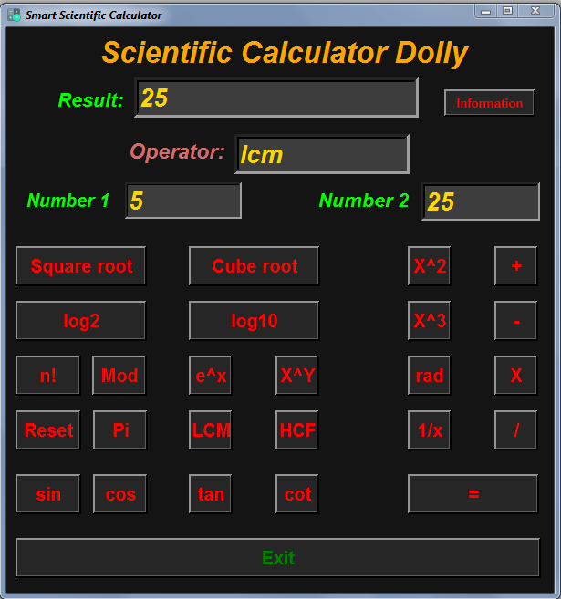

# 
 Hello Programmers  

### 
  💡 _Now I am going to present you my New Project_ 💡 

###  
⚒️ _Yes, This is Scientific Calculator made by Python(Version 3) Tkinter_

---

## 
 💻 <i>_This is a Desktop App_</i>

### 
 A Perfect Scientific Calculator for beginners

---
# 
💡 ***_Links_*** 💡

- ## [Click Here to See the Project Video](https://youtu.be/cOBuDuGY2Sc)

- ## [Follow Me on LinkedIn to Get Regular Project Updates](https://www.linkedin.com/in/samarpan-dasgupta-4aa1061b0/ "LCO")
